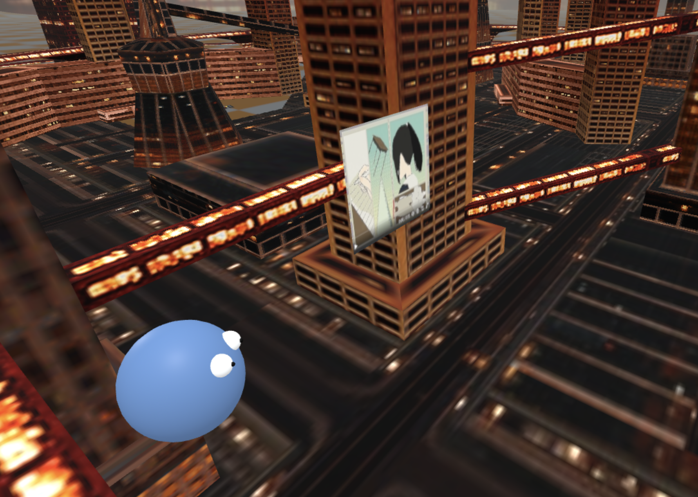

<div align="center">

# Making Vr worlds using LLMS ! 

VRConnections is a VR world maker using simple prompts. After you specify  the prompt we create the world based on the 3d Assets available and create a fully playable, collaborative world for you to explore with your friends just by sharing the link!

</div>

### example 

``` Create  me a modern city with high rise buildings and with fog. ```

### Screenshots 





### Features:
- Collaborative, play on the web, mobile, VR headset etc !
- Persistent pictures, add pictures to your VR space and chat about it with your friends !

